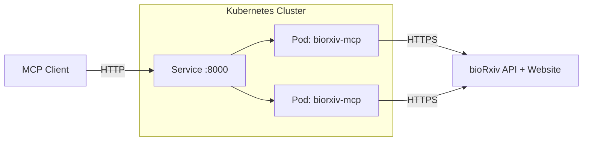
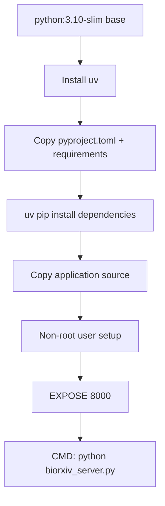

# Plan: Dockerize bioRxiv MCP Server for Kubernetes

## Overview

Containerize the bioRxiv MCP server and prepare Kubernetes manifests for deployment. The server currently uses `stdio` transport, which must change to **Streamable HTTP** for network-based access in k8s. Docker Hub will be the target registry.

---

## Architecture



## Container Build Flow



---

## Changes Required

### 1. Modify `biorxiv_server.py` — Add HTTP transport + health check

**What changes:**
- Add a `/health` custom route for k8s liveness/readiness probes
- Make transport configurable via environment variable `MCP_TRANSPORT` defaulting to `streamable-http`
- Make host/port configurable via `MCP_HOST` / `MCP_PORT` env vars defaulting to `0.0.0.0:8000`
- Keep backward compatibility: `stdio` still works for local dev

**Diff concept:**
```python
import os
from starlette.requests import Request
from starlette.responses import JSONResponse

# ... existing code ...

@mcp.custom_route("/health", methods=["GET"])
async def health_check(request: Request) -> JSONResponse:
    return JSONResponse({"status": "healthy", "service": "biorxiv-mcp"})

if __name__ == "__main__":
    transport = os.environ.get("MCP_TRANSPORT", "streamable-http")
    host = os.environ.get("MCP_HOST", "0.0.0.0")
    port = int(os.environ.get("MCP_PORT", "8000"))
    logging.info(f"Starting bioRxiv MCP server (transport={transport}, host={host}, port={port})")
    mcp.run(transport=transport, host=host, port=port)
```

### 2. Create `Dockerfile`

**Strategy:**
- Multi-stage build is unnecessary — single-stage with `python:3.10-slim`
- Use `uv` for fast dependency installation
- Run as non-root user for security
- `EXPOSE 8000`

```dockerfile
FROM python:3.10-slim

# Install uv
COPY --from=ghcr.io/astral-sh/uv:latest /uv /usr/local/bin/uv

WORKDIR /app

# Install dependencies first for layer caching
COPY pyproject.toml requirements.txt ./
RUN uv pip install --system --no-cache -r requirements.txt

# Copy application
COPY biorxiv_server.py biorxiv_web_search.py ./

# Non-root user
RUN useradd --create-home appuser
USER appuser

EXPOSE 8000

ENV MCP_TRANSPORT=streamable-http
ENV MCP_HOST=0.0.0.0
ENV MCP_PORT=8000

CMD ["python", "biorxiv_server.py"]
```

### 3. Create `.dockerignore`

```
.venv/
__pycache__/
*.py[oc]
.git/
.gitignore
build/
dist/
*.egg-info
README.md
plans/
k8s/
```

### 4. Create `k8s/deployment.yaml`

- 2 replicas for availability
- Resource limits: 128Mi–256Mi memory, 100m–250m CPU
- Liveness probe on `/health` path
- Readiness probe on `/health` path
- Environment variables for transport config

### 5. Create `k8s/service.yaml`

- ClusterIP service on port 8000
- Selector matching the deployment pods

### 6. Update `README.md`

Add a Docker/Kubernetes deployment section covering:
- Building the image
- Pushing to Docker Hub
- Deploying to k8s
- Connecting MCP clients to the HTTP endpoint

---

## File Summary

| File | Action | Purpose |
|------|--------|---------|
| `biorxiv_server.py` | Modify | Add health endpoint, HTTP transport, env-var config |
| `Dockerfile` | Create | Container image definition |
| `.dockerignore` | Create | Exclude unnecessary files from build context |
| `k8s/deployment.yaml` | Create | K8s Deployment with probes and resource limits |
| `k8s/service.yaml` | Create | K8s Service exposing the MCP server |
| `README.md` | Modify | Add deployment documentation |

---

## Key Design Decisions

1. **`streamable-http` over `sse`** — Per user preference; this is also the recommended transport for production per FastMCP docs
2. **Environment variable configuration** — Keeps the image flexible across environments; `stdio` still works for local dev by setting `MCP_TRANSPORT=stdio`
3. **`uv` for dependency management** — Per project preferences; significantly faster than pip
4. **No Ingress** — Per user request, only Deployment + Service; Ingress can be layered on later
5. **Non-root container** — Security best practice for k8s
6. **Health endpoint at `/health`** — Used by both liveness and readiness probes
